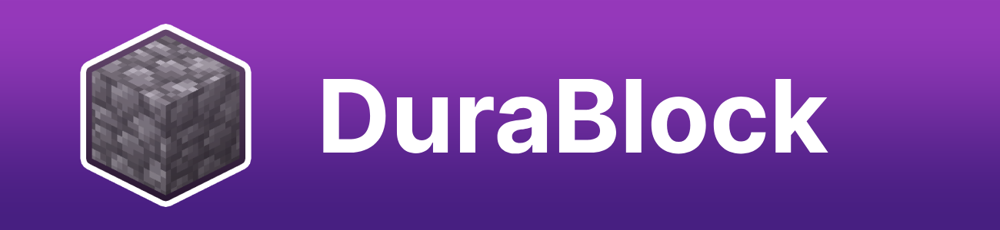

<center><div align="center">



[](https://github.com/hakanyurtoglu/durablock/releases/latest)
[](https://github.com/hakanyurtoglu/DuraBlock/blob/master/LICENSE)
[](https://discord.gg/p3PbC4afzV)

<b>
  <a href="https://modrinth.com/plugin/durablock">Modrinth</a>
</b> &nbsp;|&nbsp; <b>
  <a href="https://hangar.papermc.io/raisy/DuraBlock">Hangar</a>
</b>

</div></center>

# DuraBlock - Custom Block Durability Plugin

**DuraBlock** is a Minecraft plugin, inspired by the Metin Stones from Metin2, that allows server owners to create custom blocks with configurable durabilities. Players can race to break these blocks and earn rewards!

## 🌟 Features

* **Custom Blocks with Durability:** Set how many times a block needs to be hit before breaking.
* **Holograms:** Display custom holograms above blocks, both when active and inactive.
* **Permission Support:** Specify permissions required to break each block.
* **Sound and Broadcast Events:** Play a sound and broadcast a message when a block is broken.
* **Reward System:** Give rewards with customizable chances when a block is broken.
* **Automatic Block Restoration:** Blocks automatically reappear after a configurable interval.
* **Custom Blocks Support:** You can add custom blocks from plugins like ItemsAdder, Nexo and Oraxen.

## 🛠️ Building

To build the project from source:

```sh
git clone https://github.com/hakanyurtoglu/DuraBlock.git
cd DuraBlock
mvn clean package
```

> **Note:** JDK 21 is required to build this project.

The compiled JAR file will be located in the `target` directory.

## 🌍 Internationalization

Want to help translate DuraBlock?

1. Create a new language file inside the `resources/lang` directory named `{lang}.yml` (for example, `es_es.yml` for Spanish or `fr_fr.yml` for French).
2. Provide your translations in the new file.
3. Open a Pull Request with your new language file.

* [Languages directory](https://github.com/hakanyurtoglu/DuraBlock/tree/master/src/main/resources/lang)


Thank you for contributing to DuraBlock’s localization!

## 💬 Support

If you encounter any issues or have feature suggestions, feel free to open an issue on GitHub or join my [Discord Server](https://discord.gg/p3PbC4afzV).

## 📝 License

This project is licensed under the MIT License - see the [LICENSE](https://github.com/hakanyurtoglu/DuraBlock/blob/master/LICENSE) file for details.

Enjoy making your server more dynamic with DuraBlock!
